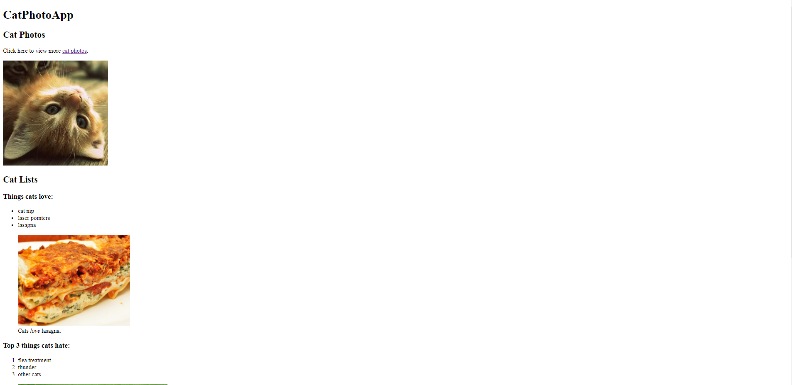
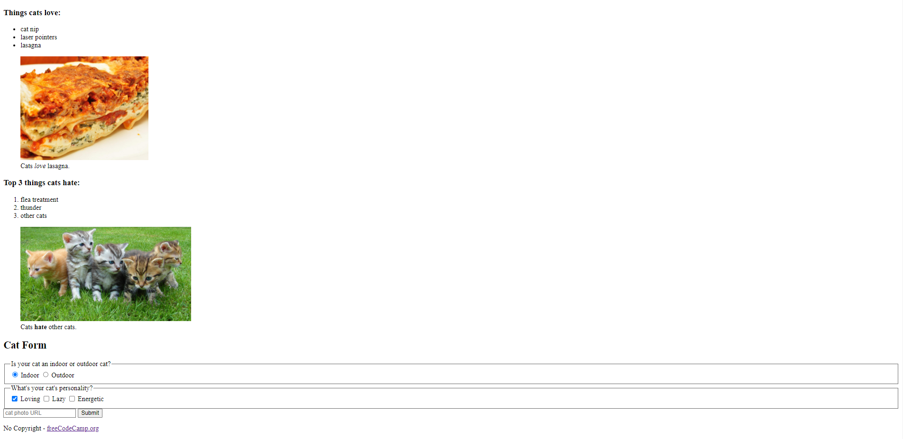

# ResponsiveWebDesign-New
This repository has projects from freeCodeCamp [(New) Responsive Web Design](https://www.freecodecamp.org/learn/2022/responsive-web-design/) courses.

### Projects

- [**Color Markers**](https://github.com/HakanK003/ResponsiveWebDesign-New/tree/main/ColorMarkers)
    - *Focused on* 
        - colors (rgb/hex/hsl), 
        - linear-gradient (180deg, 90deg...)
        - opacity, alpha channel (rgba/hexa/hsla)
        - shadow
        

           
          
        

    
- [**Cafe Menu**](https://github.com/HakanK003/ResponsiveWebDesign-New/tree/main/CafeMenu)
    - *Focused on* 
        - Basics of CSS and CSS properties
        

           
          
        

- [**Cat Photo App**](https://github.com/HakanK003/ResponsiveWebDesign-New/tree/main/CatPhotoApp)
    - *Focused on* 
        - Basics of HTML and HTML elements
        

           
          
          
        
