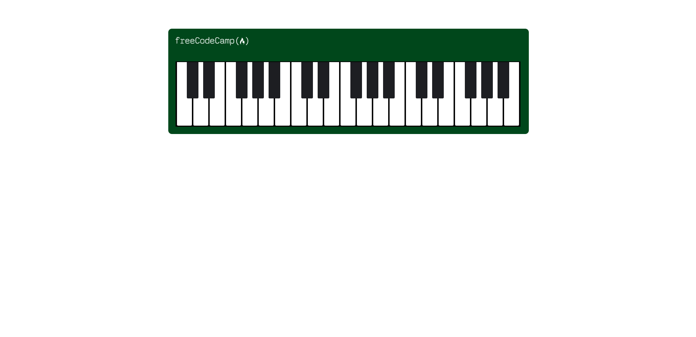

# ResponsiveWebDesign-New
This repository has projects from freeCodeCamp [(New) Responsive Web Design](https://www.freecodecamp.org/learn/2022/responsive-web-design/) courses.

## Projects

### My Projects

- [**Tribute Page**](https://github.com/HakanK003/ResponsiveWebDesign-New/tree/main/TributePage)
        

           
          
        

- [**Survey Form**](https://github.com/HakanK003/ResponsiveWebDesign-New/tree/main/SurveyForm)
        

           
          
        

### Practice Projects

- [**Piano**](https://github.com/HakanK003/ResponsiveWebDesign-New/tree/main/Piano)
    - *Focused on* 
        - Responsive Design
        

           
          
        

- [**Picasso Painting**](https://github.com/HakanK003/ResponsiveWebDesign-New/tree/main/PicassoPainting)
    - *Focused on* 
        - SVG icons
        - CSS positioning
        

           
          
        

- [**BalanceSheet**](https://github.com/HakanK003/ResponsiveWebDesign-New/tree/main/BalanceSheet)
    - *Focused on* 
        - Pseudo selectors 
        

           
          
        

- [**Quiz**](https://github.com/HakanK003/ResponsiveWebDesign-New/tree/main/Quiz)
    - *Focused on* 
        - Accessibility 
        

           
          
        

- [**Nutrition Label**](https://github.com/HakanK003/ResponsiveWebDesign-New/tree/main/NutritionLabel)
    - *Focused on* 
        - Typography
        

           
          
        

- [**Flexbox Photo Gallery**](https://github.com/HakanK003/ResponsiveWebDesign-New/tree/main/FlexboxPhotoGallery)
    - *Focused on* 
        - Flexbox
        

           
          
        

- [**Rothko Painting**](https://github.com/HakanK003/ResponsiveWebDesign-New/tree/main/RothkoPainting)
    - *Focused on* 
        - Box model
        

           
          
        

- [**Registration Form**](https://github.com/HakanK003/ResponsiveWebDesign-New/tree/main/RegistrationForm)
    - *Focused on* 
        - Input element
        - Data types
        

           
          
        

- [**Color Markers**](https://github.com/HakanK003/ResponsiveWebDesign-New/tree/main/ColorMarkers)
    - *Focused on* 
        - Colors (rgb/hex/hsl), 
        - Linear-gradient (180deg, 90deg...)
        - Opacity, alpha channel (rgba/hexa/hsla)
        - Shadow
        

           
          
        

    
- [**Cafe Menu**](https://github.com/HakanK003/ResponsiveWebDesign-New/tree/main/CafeMenu)
    - *Focused on* 
        - Basics of CSS and CSS properties
        

           
          
        

- [**Cat Photo App**](https://github.com/HakanK003/ResponsiveWebDesign-New/tree/main/CatPhotoApp)
    - *Focused on* 
        - Basics of HTML and HTML elements
        

           
          
        
